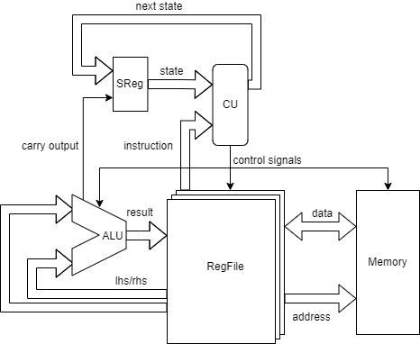

# SOCP
SOCP means Simple but Okay Computer Project.
Goals is to build a computer which is:
- ***Simple***. The core CPU must built from existing low-level logic chips like 7400-series. The most complex chip can be ROM or SRAM, but FPGA is not allowed in this project.
- ***Okay for a Personal Computer***. The final product should have simliar function of a personal computer in 1970s like Apple II. It shoud have shell, filesystem, file editor and could edit-then-run a program on the fly.

## Sub Projects

* [DCSim](https://github.com/chasingfar/DCsim)
* [SOCPU](https://github.com/chasingfar/SOCPU)
* [SOASM](https://github.com/chasingfar/SOASM)
* [SOCC](https://github.com/chasingfar/SOCC)

## Design Goals

### Hardware
 
- [x] Loop summation of 1 to 3 (first run)
- [x] LCD (first output device)
- [x] Keyboard (interupt input device)
- [x] SD card (filesystem)

### Software
- [x] DCSim (auto-test)
- [x] SOASM (embedded assembler)
- [x] SOCC (embedded compiler)
- [ ] Operating System (simple shell to run program form file)
  - [x] BIOS or bootloader (boot from SD card)
- [ ] SOCC on SOCPU (compile program on SOCPU)
## DevKits

All the devkits in this project are design by myself.
* DCSim is a simple simulator for digital locgic circuit. Support basic three-state logic and nest circuit.
* SOASM can be used to define an Instruction Set, and become an embeded assembler,dissembler,emulator with that defination.
* SOCPU can help microcode based architecture design and generate look up table by an intuitive way.
* SOCC is an embeded compiler for a C-like syntax.

## SOARCHv2
SOARCHv2 is an Micro Architecture for
SOCPU now. Supporting:
* up to 256 instructions (different register count as different instruction).
* 64KB Memory space
    * RAM/ROM ratio is changable
    * up to 256 device (Cmd/Data count as different device).
* up to 2.5MHz clock.
* ability to handle interupt by PIC 8259

## SOISv1

SOISv1 is an Instruction Set design for SOCPU to meet the minimal function for a complete computer.
It basically is stack-based so that design a compiler for it would be easy.
It has 8 general registers: A,B,C,D,E,F,L,H.4 general registers pairs: BA,DC,FE,HL (Reg16::BA is form by Reg::B at high part, and Reg::A at low part...).
### SOISv1 Instructions
Stack Push/Pop Value
* Load[Far,Near,] {from:Reg16} [offset:i8,i16] => push(MEM[from+offset])
* Save[Far,Near,] {to:Reg16} [offset:i8,i16] => MEM[to+offset]=pop()
* SaveImm {to:Reg16} val:u8 => MEM[to]=val
* ImmVal val:u8 => push(val)
* Push {from:Reg8} => push(from)
* Pop {to:Reg8} => pop(to)
* PushCF => push(CF)
* PopCF => pop(CF)

Calculation
* Calc {fn:(SHL,SHR,RCL,RCR,ADD,SUB,ADC,SUC)} => fn(pop()[,pop()]),CF=carry
* Logic {fn:(NOT,AND,OR,XOR)} => fn(pop()[,pop()])

Jump/Branch
* BranchZero addr:u16 => if pop()==0 then jump(addr)
* Jump addr:u16 => PC=addr

Call Function
* Call addr:u16 => push(PC),jump(addr)
* CallPtr => call(pop())
* Return => jump(pop())
* Adjust => offset:i16 => SP+=offset
* Enter {bp:Reg16} => push(bp),bp=sp
* Leave {bp:Reg16} => sp=bp,bp=pop()

Interrupt
* Reset {rst:u3} => call(rst<<2)
    * use both by hardware/software interrupt
    * computer start up at Instruction "Reset 0(0x00)".
* Halt
    * stop CPU to wait interrupt

### Progress

#### Fill LCD By "Hello world!"
The first success test proof that it can run a program and output something.

It is a milestone from simulation to real world.

#### Basic Input For 64 Keys Keyboard
This test proof that it can have input from keyboard by interupt so that output different in every startup.

Interupt handle is also the basestone for an Operating System.

